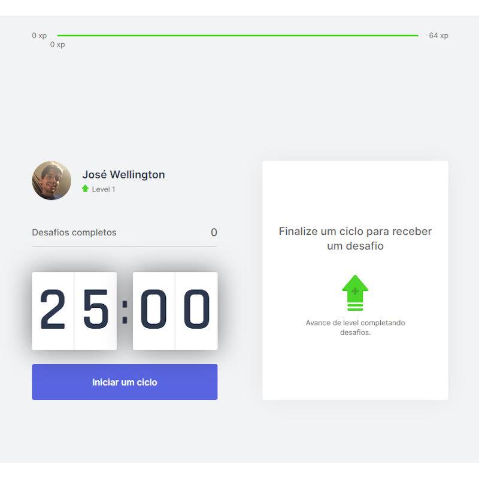

<p align="center">
   
</p>

> :rocket: Projeto feito para  ajudar os dev a se exercitarem, feito na Next Level Week #4 @Rocketseat

<p align="center">
    <a href="README.md">English</a>
    ·
    <a href="README-pt.md">Portuguese</a>
 </p>

<div align="center">
  <sub>Projeto da NLW #4. Feito por
    <a href="https://github.com/josewmarinho">José Wellington</a>

  </sub>
</div>

# :pushpin: Tabela de Conteúdo
 
* [Tecnologias](#computer-technologies)
* [Funcionalidades](#rocket-features)
* [Como rodar](#construction_worker-how-to-run)
* [Licencia](#closed_book-license)

### Web Screenshot
<div>
   
   
   
   
</div>

# :computer: Tecnologias
Esse projeto foi feito utilizando as seguintes tecnologias:

* [Typescript](https://www.typescriptlang.org/)      
* [React](https://reactjs.org/)
* [NextJS](https://nextjs.org/)   

# :rocket: Funcionalidades

* Site para ajudar a se exercitar após algum tempo parado.
* Um pequeno jogo para ajudar os dev a se exercitarem.
* Cronometro em contagem regressiva.

# :construction_worker: Como rodar
```bash
# Clone o Repositorio
$ git clone https://github.com/josewmarinho/moveit-next
```

### 💻 Rode o Project Web

```bash
# Vá para a pasta web
$ cd moveit-next

# Instale as depedencias
$ yarn install

# Rode a aplicação
$ yarn dev
```
Acesse: http://localhost:3000/ para ver o resultado.

# :closed_book: License

Lançado em 2021 :closed_book: Licencia

Feito por [José Wellington](https://github.com/josewmarinho) 🚀.
Esse projeto esta sobre [MIT license](./LICENSE).

Dê uma ⭐️ se esse projeto te ajudou!
