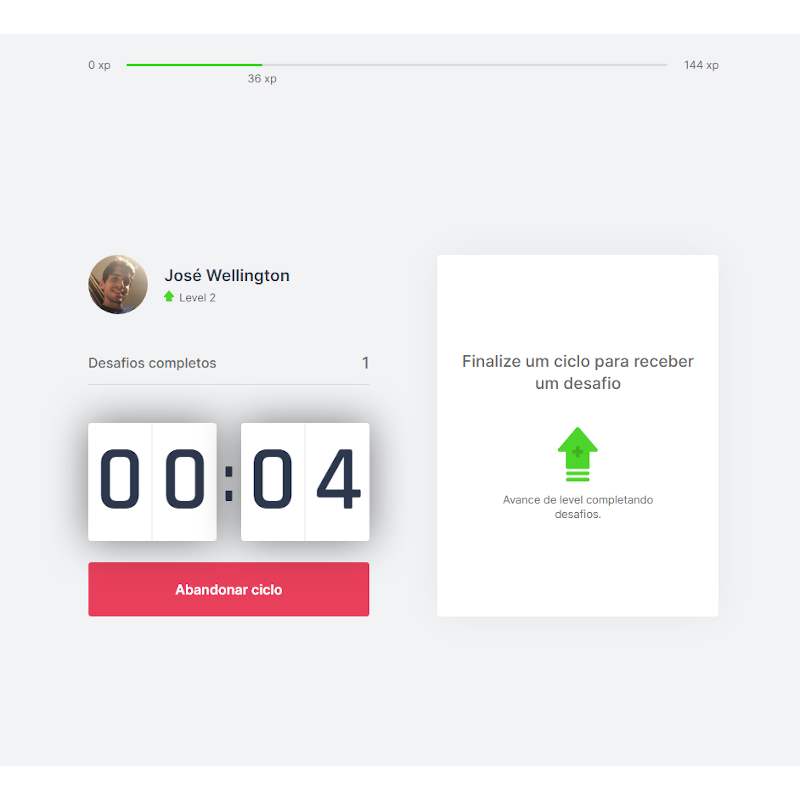
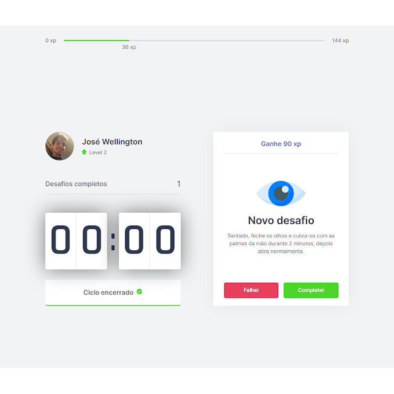
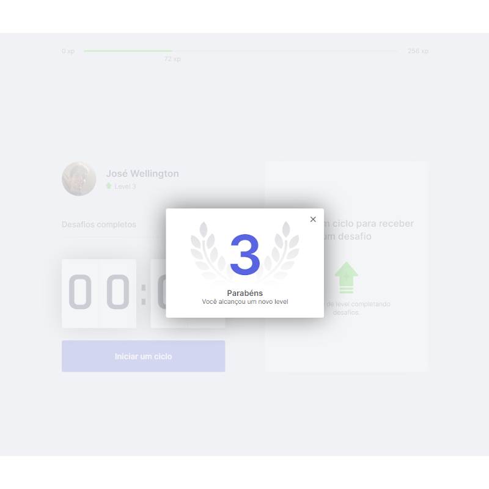

<p align="center">
   
</p>

> :rocket: Project made to connect teachers to students, made in Next Level Week #4 @Rocketseat

<p align="center">
    <a href="README.md">English</a>
    ·
    <a href="README-pt.md">Portugues</a>
 </p>

<div align="center">
  <sub>The NLW #4 project. Built with by
    <a href="https://github.com/josewmarinho">José Wellington</a>

  </sub>
</div>

# :pushpin: Table of Contents

* [Technologies](#computer-technologies)
* [Features](#rocket-features)
* [How to Run](#construction_worker-how-to-run)
* [License](#closed_book-license)
  
### Web Screenshot
<div>
   
   
   
</div>

# :computer: Technologies
This project was made using the follow technologies:

* [Typescript](https://www.typescriptlang.org/)      
* [React](https://reactjs.org/)      
* [Next](https://nextjs.org/)      

# :rocket: Features

* Site to help you exercise after some time off.
* A little game to help devs exercise.
* Countdown timer.

# :construction_worker: How to run
```bash
# Clone Repository
$ git clone https://github.com/josewmarinho/moveit-next
```

### 💻 Run Web Project

```bash
# Go to web folder
$ cd moveit-next

# Install Dependencies
$ yarn install

# Run Aplication
$ yarn dev
```
Go to http://localhost:3000/ to see the result.


# :closed_book: License

Released in 2020 :closed_book: License

Made by [José Wellington](https://github.com/josewmarinho) 🚀.
This project is under the [MIT license](./LICENSE).

Give a ⭐️ if this project helped you!
